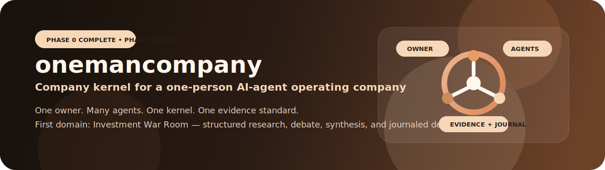
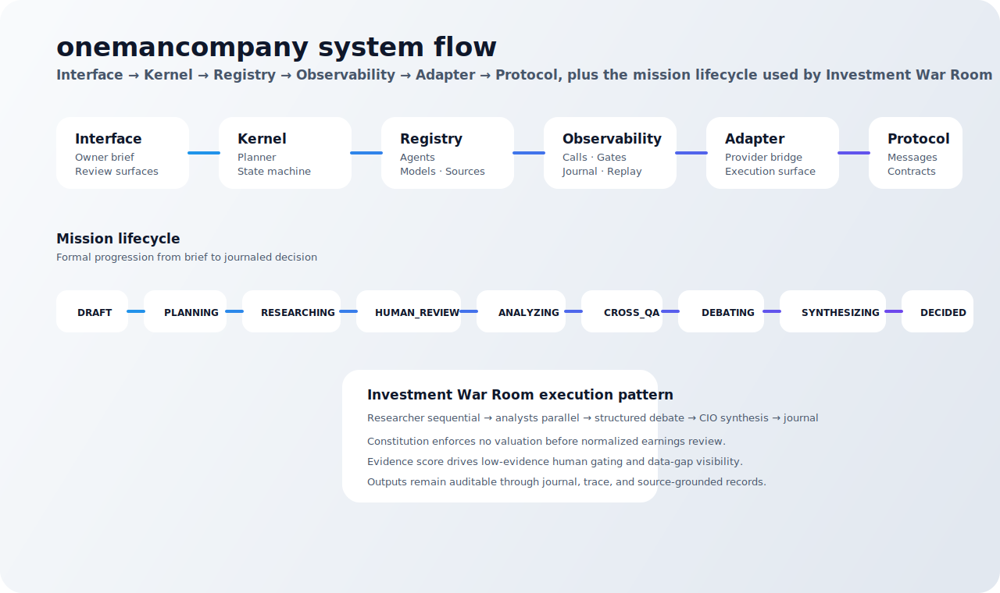

# onemancompany




> A company-kernel architecture for a one-person AI-agent operating company.

## Overview

**onemancompany** is a blueprint-first project for building a personal company
system powered by multiple AI agents, formal operating rules, structured
evidence, and durable decision memory.

The core idea is:

- one owner
- many specialized agents
- one stable company kernel
- one shared evidence standard
- one auditable mission lifecycle

The first domain is **Investment War Room** — a system for evidence-backed
investment analysis, structured disagreement, synthesis, and decision journaling.

## Design direction

This repository follows a warm, premium visual direction inspired by the
professional feel of Claude-like product design: calm neutrals, soft sand,
bronze, and deep espresso tones. The design goal is clarity, seriousness, and
trust — not hype.

## Current status

### Delivery status

- **Phase 0 — Specification Freeze:** complete
- **Phase 1 — Kernel Core:** not implemented yet in this repository
- **Practical state:** ready to begin Phase 1 implementation

This repo currently contains the contracts, registries, flows, schemas, and
domain definitions required before runtime code should be written.

## Visual assets

### Project banner

- `docs/assets/onemancompany-banner.svg`

### Project icon

- `docs/assets/onemancompany-icon.svg`

### Architecture and execution flow



- `docs/assets/onemancompany-flow.svg`

## What the project actually contains

### Specifications

- `docs/PROJECT_CHARTER.md`
- `docs/ARCHITECTURE.md`
- `docs/MISSION_LIFECYCLE.md`
- `docs/AGENT_MODEL.md`
- `docs/DEBATE_PROTOCOL.md`
- `docs/COMPANY_CONSTITUTION.md`
- `docs/JOURNAL_SCHEMA.md`
- `docs/JOURNAL_SCHEMA.sql`
- `docs/EVIDENCE_STANDARD.md`
- `docs/DOMAIN_TEMPLATE.md`

### Registries

- `registry/agents/*.yaml` — 12 Investment War Room agents
- `registry/models.yaml` — model and routing registry
- `registry/sources.yaml` — source groups and document catalog

### Domains

- `domains/investment-war-room/domain.yaml`
- `domains/investment-war-room/domain-constitution.yaml`
- `domains/investment-war-room/missions/*.yaml`
- `domains/investment-war-room/journal/investment-journal.yaml`
- `domains/_template/*`

## Tech stack

### Current repository stack

This phase is intentionally **document-first**.

| Layer | Current stack |
| --- | --- |
| Specification | Markdown + YAML |
| Persistence contract | SQLite schema |
| Visual assets | SVG |
| Validation used in repo | markdownlint, yamllint, Python YAML parsing, SQLite in-memory parse |
| Source of truth | `onemancompany-blueprint-v2.md` |

### Planned implementation stack from the blueprint

| Concern | Planned stack |
| --- | --- |
| Kernel / orchestration | TypeScript / Node.js |
| CLI / interface | TypeScript CLI |
| Persistence | SQLite |
| Validation | Zod runtime schemas |
| Adapters | Claude, Gemini, Codex, ZAI, Human, future local LLM |
| Domain runtime | Investment War Room first |

## Architecture flow

The architecture defined in `docs/ARCHITECTURE.md` is centered on a stable
kernel with replaceable outer layers.

### Layer map

1. **Interface** — receives owner input and renders human review/output
2. **Kernel** — planner, lifecycle, constitution, synthesis, coordination
3. **Registry** — agents, models, sources, domains
4. **Observability** — traces, journals, replay, scorecards
5. **Adapter** — provider and runtime bridges
6. **Protocol** — internal message contracts

### Mission flow

A future runtime should follow this operational sequence:

1. owner submits a brief
2. kernel plans the mission
3. researchers gather evidence
4. analysts produce parallel perspectives
5. cross-QA and debate test assumptions
6. CIO synthesizes a decision-ready output
7. journal records the result and follow-up state

## Investment War Room

The first domain turns the kernel into an investment decision company.

It is designed to support:

- official-source research
- normalized-earnings review
- valuation and downside analysis
- cross-agent challenge
- disagreement preservation
- CIO synthesis
- decision journaling

The current roster includes 12 roles such as:

- `researcher-set`
- `researcher-us`
- `forensic-accountant`
- `damodaran-valuation`
- `klarman-downside`
- `portfolio-allocator`
- `cio-synthesizer`
- `book-master`

See:

- `docs/AGENT_MODEL.md`
- `registry/agents/*.yaml`
- `domains/investment-war-room/domain.yaml`

## Why this repository matters before code

The blueprint explicitly warns against starting implementation before the spec is
clear. This repository reduces that risk by locking down:

- the mission state machine
- agent identity and output contracts
- debate rules
- constitutional guardrails
- evidence labels and source tiers
- journal persistence shape
- domain extensibility rules

That means Phase 1 can build against a stable contract instead of inventing core
behavior ad hoc.

## Repository structure

```text
onemancompany/
├── README.md
├── onemancompany-blueprint-v2.md
├── docs/
│   ├── PROJECT_CHARTER.md
│   ├── ARCHITECTURE.md
│   ├── MISSION_LIFECYCLE.md
│   ├── AGENT_MODEL.md
│   ├── DEBATE_PROTOCOL.md
│   ├── COMPANY_CONSTITUTION.md
│   ├── JOURNAL_SCHEMA.md
│   ├── JOURNAL_SCHEMA.sql
│   ├── EVIDENCE_STANDARD.md
│   ├── DOMAIN_TEMPLATE.md
│   └── assets/
├── registry/
│   ├── agents/
│   ├── models.yaml
│   └── sources.yaml
└── domains/
    ├── _template/
    └── investment-war-room/
```

## Recommended reading order

1. `onemancompany-blueprint-v2.md`
2. `docs/PROJECT_CHARTER.md`
3. `docs/ARCHITECTURE.md`
4. `docs/MISSION_LIFECYCLE.md`
5. `docs/EVIDENCE_STANDARD.md`
6. `docs/COMPANY_CONSTITUTION.md`
7. `docs/AGENT_MODEL.md`
8. `domains/investment-war-room/domain.yaml`

## Validation status

The current repository artifacts have already passed local validation:

- Markdown lint
- YAML lint
- YAML parse checks
- SQLite in-memory schema parse
- agent, source, and path cross-reference checks
- final artifact review with approval/clear result on generated Phase 0 assets

## What comes next

The next implementation milestone is **Phase 1 — Kernel Core**.

That phase should focus on:

- mission state machine
- mission planner
- registry loaders
- constitution enforcement
- context budget logic
- journal writer
- observability foundations

In short:

> build the kernel against these contracts, not around them.

## Scope boundary

This repository does **not** currently include:

- runtime kernel code
- adapter implementations
- web UI
- deployment infrastructure
- live model execution

Those belong to the implementation phases that follow.

## Source of truth

Primary design source:

- `onemancompany-blueprint-v2.md`

The files in `docs/`, `registry/`, and `domains/` are the implementation-facing
contracts derived from that blueprint.
